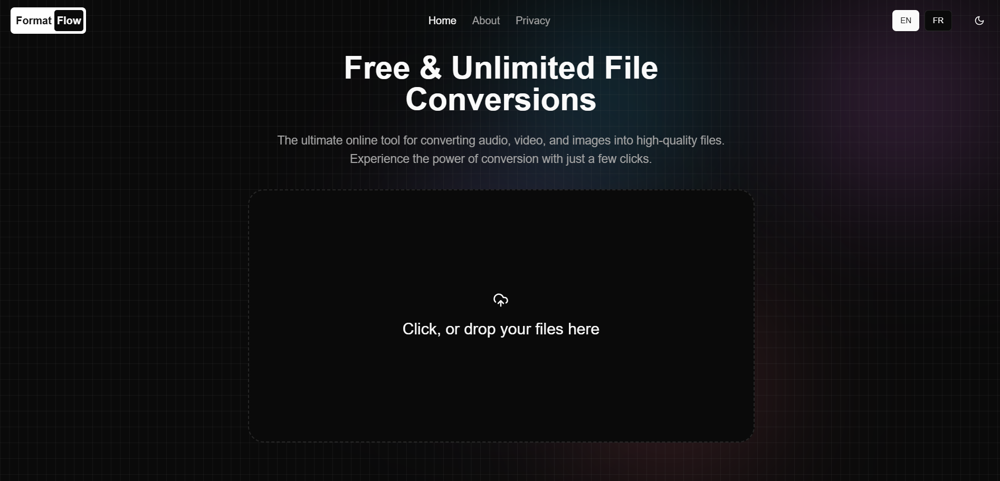

# Media Converter

A modern, browser-based media conversion tool built with Next.js. Convert audio, video, and images with ease, all processed directly in your browser for maximum privacy and security.



## Features

- **Browser-Based Processing**: All conversions happen locally in your browser
- **Privacy-First**: No file uploads to servers, ensuring maximum data security
- **Multiple Formats**: Support for various audio, video, and image formats
- **Modern UI**: Clean, responsive design with dark mode support
- **Multilingual**: Available in English and French
- **Fast & Efficient**: Powered by WebAssembly for near-native performance
- **Free & Unlimited**: No restrictions on file size or number of conversions

## Tech Stack

- **Framework**: [Next.js 14](https://nextjs.org/) with App Router
- **Styling**: [Tailwind CSS](https://tailwindcss.com/) with custom animations
- **Media Processing**: [FFmpeg.wasm](https://github.com/ffmpegwasm/ffmpeg.wasm)
- **UI Components**: Custom components with Radix UI primitives
- **Animations**: Framer Motion
- **File Handling**: React Dropzone
- **Type Safety**: TypeScript
- **Notifications**: Sonner

## Getting Started

1. **Clone the repository**

```bash
git clone https://github.com/bellandry/media-converter.git
cd media-converter
```

2. **Install dependencies**

```bash
npm install
# or
yarn install
# or
pnpm install
```

3. **Run the development server**

```bash
npm run dev
# or
yarn dev
# or
pnpm dev
```

Open [http://localhost:3000](http://localhost:3000) with your browser to see the application.

## Project Structure

- `app/` - Next.js app router pages and layouts
- `components/` - Reusable UI components
- `constants/` - Application constants and translations
- `context/` - React context providers
- `lib/` - Utility functions and shared logic
- `public/` - Static assets
- `store/` - State management
- `utils/` - Helper functions

## Key Features Implementation

### Client-Side Processing

All file conversions are performed entirely in the browser using FFmpeg.wasm, ensuring:
- No server uploads required
- Maximum privacy and security
- Faster processing for small to medium-sized files
- Reduced server costs and complexity

### Responsive Design

The UI is built with a mobile-first approach, featuring:
- Fluid typography and spacing
- Responsive grid layouts
- Touch-friendly interactions
- Adaptive UI elements

### Internationalization

Built-in support for multiple languages with:
- Easy-to-maintain translation files
- Automatic language detection
- Smooth language switching

## Contributing

Contributions are welcome! Please feel free to submit a Pull Request.

## Author

[Landry Bella](https://laclass.dev)

## Acknowledgments

- [FFmpeg.wasm](https://github.com/ffmpegwasm/ffmpeg.wasm) for making browser-based media processing possible
- [Next.js](https://nextjs.org) team for the amazing framework
- All the open-source contributors whose libraries made this project possible
